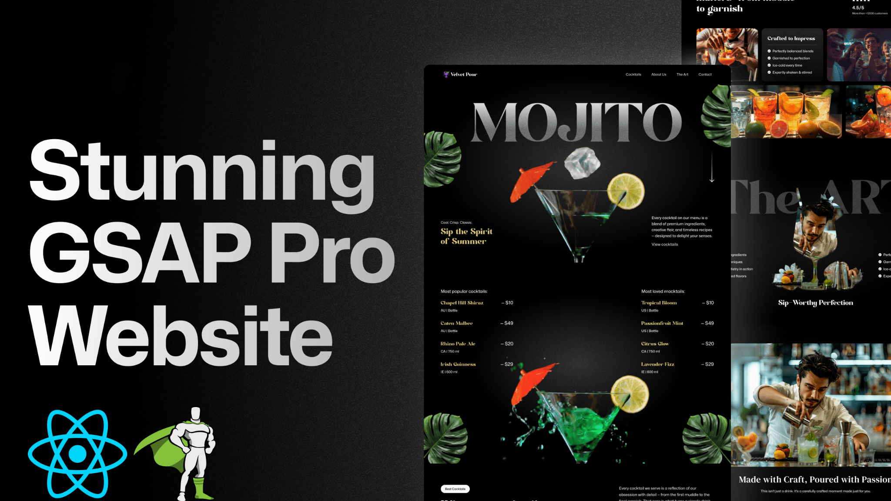

# 🍹 GSAP Cocktails Landing Page

A sophisticated, interactive cocktail bar website featuring smooth GSAP animations, scroll-triggered effects, and immersive video backgrounds. This project demonstrates advanced frontend development skills with modern React patterns and cutting-edge animation techniques.



## ✨ Features

- **Smooth GSAP Animations**: Text splitting, timeline animations, and scroll-triggered effects
- **Immersive Video Background**: Scroll-controlled video playback for engaging user experience
- **Interactive Cocktail Menu**: Dynamic slider with smooth transitions and parallax effects
- **Responsive Design**: Optimized for desktop and mobile devices
- **Modern UI/UX**: Clean, elegant design with custom typography and gradients
- **Performance Optimized**: Efficient animations and lazy loading

## 🚀 Live Demo

[View Live Demo](https://symphonious-dieffenbachia-d9d2a7.netlify.app/) 

## 🛠️ Technologies Used

### Frontend Framework
- **React 19.1.0** - Modern React with latest features
- **Vite 6.3.5** - Fast build tool and development server
- **TypeScript** - Type safety for enhanced development experience

### Animation & Effects
- **GSAP 3.13.0** - Professional-grade animation library
- **@gsap/react** - React integration for GSAP
- **ScrollTrigger** - Scroll-based animation triggers
- **SplitText** - Advanced text animation effects

### Styling & Design
- **Tailwind CSS 4.1.10** - Utility-first CSS framework
- **Custom CSS** - Tailored animations and effects
- **Responsive Design** - Mobile-first approach with react-responsive

### Development Tools
- **ESLint** - Code linting and quality assurance
- **Modern JavaScript** - ES6+ features and modules

## 📁 Project Structure

```
gsap_cocktails/
├── public/
│   ├── images/          # High-quality cocktail imagery
│   ├── videos/          # Background video assets
│   ├── fonts/           # Custom typography
│   └── readme/          # Documentation assets
├── src/
│   ├── components/      # React components
│   │   ├── Hero.jsx    # Landing section with video
│   │   ├── Cocktails.jsx # Cocktail listings
│   │   ├── About.jsx   # About section with grid
│   │   ├── Menu.tsx    # Interactive cocktail slider
│   │   ├── Art.jsx     # Gallery section
│   │   ├── Contact.jsx # Contact information
│   │   └── Navbar.jsx  # Navigation component
│   ├── App.jsx         # Main application component
│   ├── main.jsx        # Application entry point
│   └── index.css       # Global styles and utilities
├── constants/          # Data and configuration
└── package.json        # Dependencies and scripts
```

## 🎯 Key Components

### Hero Section
- Scroll-triggered video background
- Text splitting animations with gradient effects
- Parallax leaf decorations
- Responsive design adaptations

### Cocktail Menu
- Interactive slider with smooth transitions
- Dynamic content updates
- Arrow navigation with preview
- Accessibility features

### About Section
- Grid-based image layout
- Staggered animation reveals
- Customer rating display
- Professional photography showcase

## 🚀 Getting Started

### Prerequisites
- Node.js (v16 or higher)
- npm or yarn

### Installation

1. **Clone the repository**
   ```bash
   git clone https://github.com/yourusername/gsap-cocktails.git
   cd gsap-cocktails
   ```

2. **Install dependencies**
   ```bash
   npm install
   ```

3. **Start development server**
   ```bash
   npm run dev
   ```

4. **Open your browser**
   Navigate to `http://localhost:5173`

### Build for Production

```bash
npm run build
```

### Preview Production Build

```bash
npm run preview
```

## 🎨 Customisation

### Adding New Cocktails
Edit `constants/index.js` to add new cocktails to the menu:

```javascript
const cocktailLists = [
  {
    name: "Your Cocktail Name",
    country: "Country Code",
    detail: "Description",
    price: "£XX"
  }
];
```

### Modifying Animations
GSAP animations are configured in each component using the `useGSAP` hook:

```javascript
useGSAP(() => {
  gsap.from(".element", {
    y: 100,
    opacity: 0,
    duration: 1,
    ease: "power2.out"
  });
});
```

### Styling
- Global styles: `src/index.css`
- Component-specific styles: Tailwind classes
- Custom utilities: Defined in CSS with `@utility` directive

## 📱 Responsive Design

The project is fully responsive with breakpoints:
- **Mobile**: < 768px
- **Tablet**: 768px - 1024px
- **Desktop**: > 1024px

## ⚡ Performance Features

- **Lazy Loading**: Images and videos load on demand
- **Optimised Animations**: Hardware-accelerated transforms
- **Efficient Bundling**: Vite's optimised build process
- **Code Splitting**: Automatic route-based splitting

## 🎬 Animation Highlights

- **Text Splitting**: Character-by-character reveal animations
- **Scroll Triggers**: Elements animate based on scroll position
- **Parallax Effects**: Background elements move at different speeds
- **Timeline Animations**: Complex multi-step animation sequences
- **Video Integration**: Scroll-controlled video playback

## 🙏 Acknowledgments

- [GSAP](https://greensock.com/gsap/) for the amazing animation library
- [Tailwind CSS](https://tailwindcss.com/) for the utility-first CSS framework
- [React](https://reactjs.org/) for the component-based architecture
- [Vite](https://vitejs.dev/) for the fast build tool

---

⭐ **Star this repository if you found it helpful!**